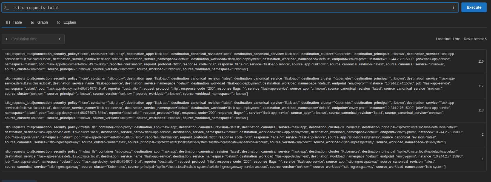
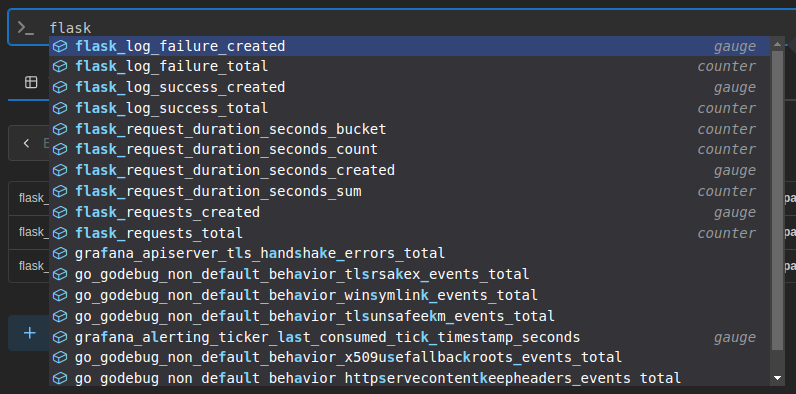
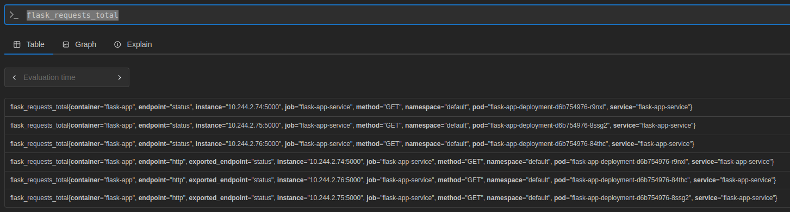
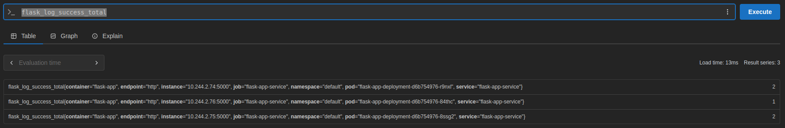
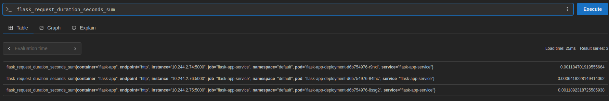

# Первое домашнее задание (UPDATE ниже):

## Запуск развертки:

```
chmod +x simplescripts/deploy.sh && ./simplescripts/deploy.sh
```

## Запуск curl-пода:

```
kubectl delete pod curl-pod
kubectl run curl-pod --image=curlimages/curl --restart=Never -i --tty -- sh
```

## Запись сообщений в логи с балансировкой из curl-пода:

```
curl -X POST http://flask-app-service:5000/log -H "Content-Type: application/json" -d '{"message": "text"}'
```

## Запуск временного контейнера с вмонтированным volume cronjob-ы:

```
kubectl delete pod debug-pvc
kubectl run debug-pvc \
  --rm -i --tty --image=busybox:1.35.0-uclibc \
  --restart=Never \
  --overrides='
  {
    "apiVersion":"v1",
    "spec":{
      "containers":[{
        "name":"shell",
        "image":"busybox:1.35.0-uclibc",
        "stdin":true,
        "tty":true,
        "volumeMounts":[{"mountPath":"/archive","name":"archive-vol"}]
      }],
      "volumes":[{"name":"archive-vol","persistentVolumeClaim":{"claimName":"log-archive-pvc"}}]
    }
  }' -- sh
```

## Как заходим, читаем лог (timestamp и имя пода будет отличаться):

```
cd archive/logs-20250520212902 && cat log-agent-gd6bl.log
```

## Чистим кластер:

```
chmod +x simplescripts/clear.sh && ./simplescripts/clear.sh
```

# Второе домашнее задание (UPDATE ниже):

## Запуск развертки:

```
chmod +x simplescripts/deploy.sh && ./simplescripts/deploy.sh
```

## Смотрим, работает ли у нас Istio:

```
kubectl get pods -n istio-system
```

## Проверяем состояние шлюза и сервиса:

```
kubectl get gateway,virtualservice -n default
```

## Смотрим external-ip для обращения к приложению:

```
$ kubectl -n istio-system get svc istio-ingressgateway
NAME                   TYPE           CLUSTER-IP     EXTERNAL-IP   PORT(S)                                                                      AGE
istio-ingressgateway   LoadBalancer   10.98.223.22   <pending>     15021:31102/TCP,80:30686/TCP,443:32347/TCP,31400:32719/TCP,15443:30912/TCP   5m48s
```

## Видим что он в статусе pending, это потому что minikube по умолчанию не предоставляет LoadBlancer. Вызовем `minikube tunnel` в отдельном окне и повторим:

```
$ kubectl -n istio-system get svc istio-ingressgateway
NAME                   TYPE           CLUSTER-IP     EXTERNAL-IP    PORT(S)                                                                      AGE
istio-ingressgateway   LoadBalancer   10.98.223.22   10.98.223.22   15021:31102/TCP,80:30686/TCP,443:32347/TCP,31400:32719/TCP,15443:30912/TCP   6m4s
```

## Попробуем теперь послать запрос без отдельного curl-pod, на 80 порт адреса, который теперь открыт всем желающим (из-за задержки в 2 секунды, ответ придет не сразу):

```
$ curl -X POST http://10.98.223.22/log -H "Content-Type: application/json" -d '{"message":"test"}' -v
Note: Unnecessary use of -X or --request, POST is already inferred.
*   Trying 10.98.223.22:80...
* Connected to 10.98.223.22 (10.98.223.22) port 80 (#0)
> POST /log HTTP/1.1
> Host: 10.98.223.22
> User-Agent: curl/7.81.0
> Accept: */*
> Content-Type: application/json
> Content-Length: 18
> 
* Mark bundle as not supporting multiuse
< HTTP/1.1 201 Created
< server: istio-envoy
< date: Tue, 20 May 2025 22:29:57 GMT
< content-type: application/json
< content-length: 42
< x-envoy-upstream-service-time: 18
< 
{
  "message": "Log saved successfully"
}
* Connection #0 to host 10.98.223.22 left intact
```

## Попробуем заведомо неверный путь:

```
$ curl -v http://10.98.223.22/wrong
*   Trying 10.98.223.22:80...
* Connected to 10.98.223.22 (10.98.223.22) port 80 (#0)
> GET /wrong HTTP/1.1
> Host: 10.98.223.22
> User-Agent: curl/7.81.0
> Accept: */*
> 
* Mark bundle as not supporting multiuse
< HTTP/1.1 404 Not Found
< date: Tue, 20 May 2025 22:36:26 GMT
< server: istio-envoy
< content-length: 0
< 
* Connection #0 to host 10.98.223.22 left intact
```

## Попробуем верный путь, но определенный без задержек (мы получаем ответ мгновенно):

```
$ curl -v http://10.98.223.22/status
*   Trying 10.98.223.22:80...
* Connected to 10.98.223.22 (10.98.223.22) port 80 (#0)
> GET /status HTTP/1.1
> Host: 10.98.223.22
> User-Agent: curl/7.81.0
> Accept: */*
> 
* Mark bundle as not supporting multiuse
< HTTP/1.1 200 OK
< server: istio-envoy
< date: Tue, 20 May 2025 22:36:33 GMT
< content-type: application/json
< content-length: 21
< x-envoy-upstream-service-time: 3
< 
{
  "status": "ok"
}
* Connection #0 to host 10.98.223.22 left intact
```

## Чистим кластер:

```
chmod +x simplescripts/clear.sh && ./simplescripts/clear.sh
```

# UPDATE:

## Я обновила VirtualService, чтобы на том же Gatewy раутиться еще и в сервис прометеуса. Кроме того, я добавила файл prometheus-monitor.yaml, чтобы поставить самый простой ServiceMonitor прометеуса и дописала свое приложение с помощью декоратора, накапливая метрики и отдавая их по ручке `/monitor`, который указала в ServiceMonitor. Обязательно также требуется установить аддон истио для прометеуса (и устанавливать сам прометеус с корректной конфигурацией для автодискавери values - см. файл prometheus-values.yaml), прежде чем его ставить, иначе ничего не получится. Теперь я покажу что из этого получилось.

## Запуск развертки (с установкой prometheus helm-чарта):

```
chmod +x simplescripts/deploy.sh && ./simplescripts/deploy.sh
```

## Аналогично предыдущим дз, запустим в отдельном окне `minikube tunnel` и посмотрим external-ip:

```
$ kubectl -n istio-system get svc istio-ingressgateway
NAME                   TYPE           CLUSTER-IP      EXTERNAL-IP     PORT(S)                                                                      AGE
istio-ingressgateway   LoadBalancer   10.102.78.112   10.102.78.112   15021:30398/TCP,80:31378/TCP,443:30859/TCP,31400:32067/TCP,15443:31943/TCP   94s
```

## Добавим запись `10.102.78.112 prometheus.test` в `/etc/hosts` (командой `sudo nano /etc/hosts`) для дальнейшей удобной работы с GUI prometheus-а, и перейдем по `http://prometheus.test` в браузере. Prometheus из коробки видит метрики Envoy proxy (надо только сначала injection=enabled делать, и только потом уже поды создавать), убедимся в этом, предварительно покурлив свое приложение как в предыдущем задании:




## Посмотрим теперь на метрики нашего приложения:



## Например, вот метрика `flask_requests_total`:



## А вот метрика `flask_log_success_total` после того, как мы несколько раз дали нагрузку на приложение (`curl -X POST http://10.102.78.112/log -H "Content-Type: application/json" -d '{"message":"test"}' -v`): 



## Также мереется и метрика времени обращения:

